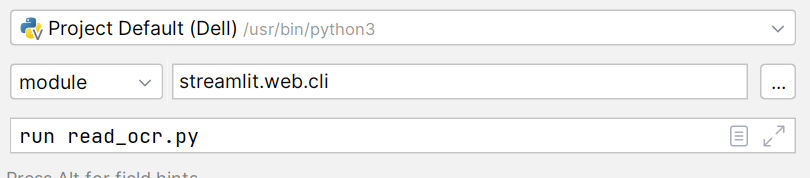

## Windows Users:

1. Go to File -> Settings -> Tools -> Terminal.

2.Replace the value in Shell path with

```
powershell.exe -ExecutionPolicy ByPass -NoExit -Command "& conda activate <yourcondaenvname>
```

## Debug Streamlit
1. For pycharm go to edit environment
2. Change script to module
3. Add streamlit.web.cli
4. run the name of your file.py



***
## Run code
1. Install the dependencies from requirements.txt
2. Run streamlit 
   * streamlit run <Filename.py>
   * python -m streamlit <Filename.py>

## Dependencies

These are the packages needed to run all the demos. These specific versions from the **requirements.txt** are known to work, but this does not mean 
older or newer versions will cause any issues. All the needed libraries can be installed by:

   `pip install -r requirements.txt`

## Run StCommand Port number

- AWS
```jupyterpython
python3 -m streamlit run UI_Demo.py --server.port 8888
```

- Local
```jupyterpython
python3 -m streamlit run UI_Demo.py
```