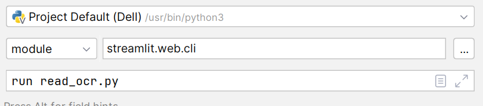

## Windows Users:

1. Go to File -> Settings -> Tools -> Terminal.

2.Replace the value in Shell path with

```
powershell.exe -ExecutionPolicy ByPass -NoExit -Command "& conda activate <yourcondaenvname>
```

## Debug Streamlit
1. For pycharm go to edit environment
2. Change script to module
3. Add streamlit.web.cli
4. run the name of your file.py



***
## Data lives in S3, not on disk

Every dataset, image, audio and video file these apps use has been moved to:

```
s3://dats-dl/ajafari@gwu.edu/streamlit/
    static/       flower.png, background.webp, myaudio.ogg, myvideo.mp4, gwu.jpg
    data/         the sample datasets, mirroring the combined_code/ tree
    CheatSheet/   streamlit_cheat_sheet.pdf
```

Nothing is read from the repo any more. `s3_utils.py` in this folder is the one
place that talks to S3:

```python
import s3_utils

df    = s3_utils.read_csv("data/time_series/forecasting/air_pollution.csv")
image = s3_utils.read_image("static/flower.png")
raw   = s3_utils.read_bytes("static/myvideo.mp4")

# a file picker that browses S3 by default, with upload as the fallback
file = s3_utils.file_input("CSV data file", folder="data/data_mining/classification",
                           types=["csv"])
```

### Credentials

Keys are read from `../S3/.env` -- the same file `S3/s3_manager.py` uses, so
there is only one place to update them. A `Streamlit/.env` or real environment
variables override it if you prefer.

**When the keys expire**, any app that reads from S3 stops and shows a
*"AWS keys need to be updated"* panel naming the exact file to edit, plus a
**retry** button. To fix it:

1. Restart your AWS lab and copy the fresh credentials.
2. Paste `AWS_ACCESS_KEY_ID`, `AWS_SECRET_ACCESS_KEY` and `AWS_SESSION_TOKEN`
   into `S3/.env` (the session token is required for keys starting with `ASIA`).
3. Press the retry button in the app -- no restart needed.

To browse or re-upload the files from a terminal, use `S3/s3_manager.py`:

```bash
python S3/s3_manager.py ls streamlit/ -r
```

***
## Run code
1. Install the dependencies from requirements.txt
2. Run streamlit 
   * streamlit run <Filename.py>
   * python -m streamlit <Filename.py>

## Dependencies

These are the packages needed to run all the demos. These specific versions from the **requirements.txt** are known to work, but this does not mean 
older or newer versions will cause any issues. All the needed libraries can be installed by:

   `pip install -r requirements.txt`

## Run Streamlit Command Port number

- AWS
```jupyterpython
python3 -m streamlit run UI_Demo.py --server.port 8888
```

- Local
```jupyterpython
python3 -m streamlit run UI_Demo.py
```